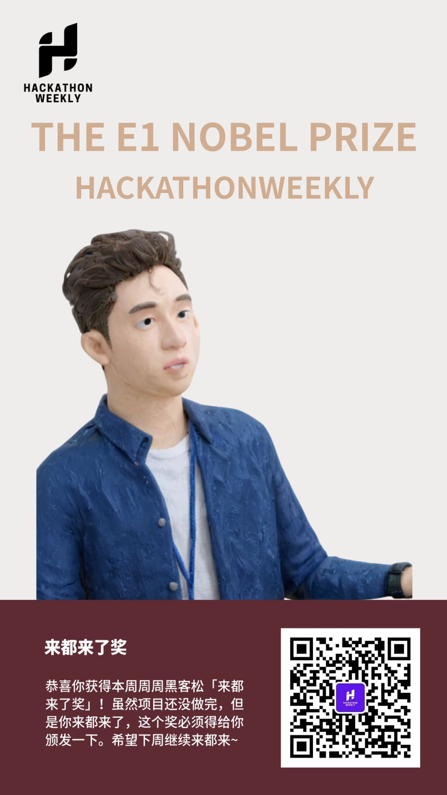

# 周周黑客松电子奖状生成器

使用 AI 为每位参与者生成独特的奖状，记录每一个精彩瞬间。上传照片，填写奖项名称和颁奖词， 让我们为每一份努力喝彩！



## Development

参考 `.env.example` 文件，修改 `.env` 文件中的环境变量，其中 api key / bot id 参考 [Coze API 文档](https://www.coze.cn/docs/developer_guides/coze_api_overview) 获取

```bash
pnpm install
pnpm dev
```

## Deployment

### Vercel (推荐)

1. Fork 此项目到你的 GitHub 账户
2. 在 [Vercel](https://vercel.com) 创建新项目
3. 导入你 fork 的仓库
4. 在项目设置中添加环境变量（与 `.env` 文件相同）
5. 部署完成后即可访问

### 自托管

```bash
# 1. 克隆仓库
git clone https://github.com/jackiexiao/coze-nobel-prize.git
cd coze-nobel-prize

# 2. 安装依赖并构建
pnpm install
pnpm build

# 3. 使用 PM2 运行
pm2 start npm --name "coze-nobel-prize" -- start
```
